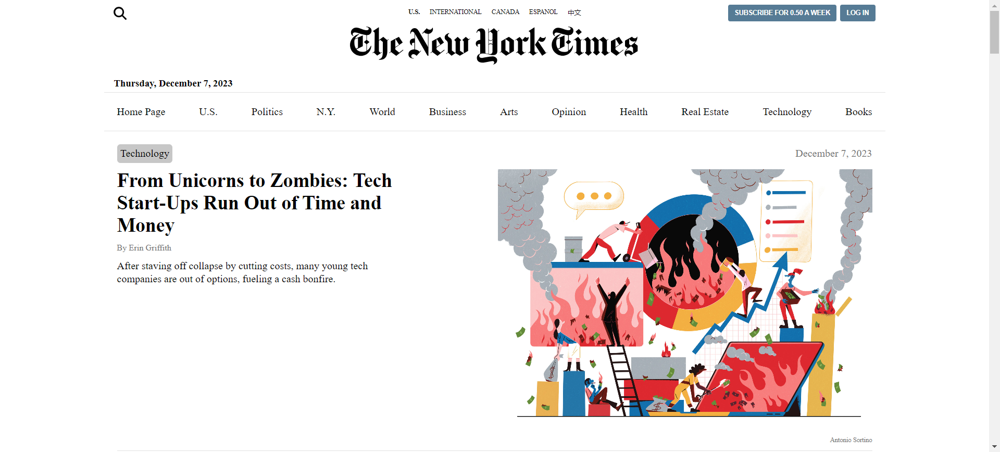
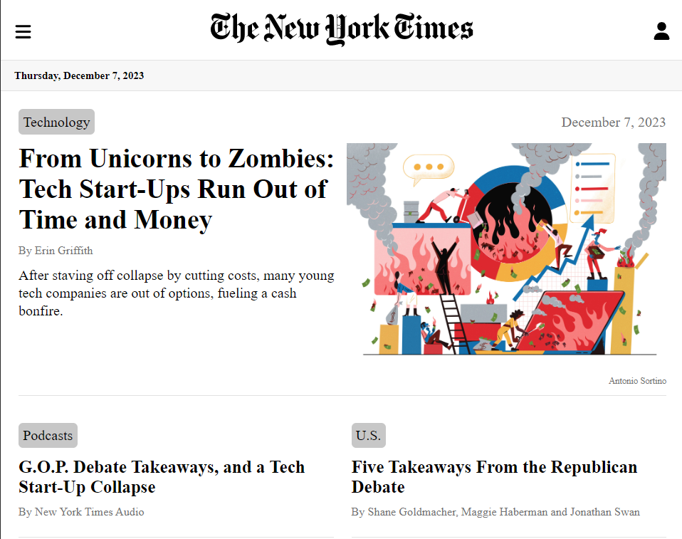
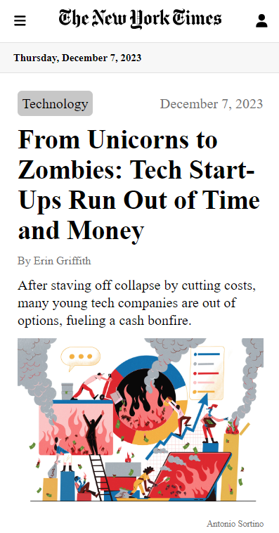

<h1 align="center">New York Times Clone</h1>
 

Click here to visit the <a href="https://newyorktimes-website-clone.netlify.app/"><strong>website</strong></a>

## 🗂️ Table of contents

- [Introduction to Project](#introduction-to-project)
  - [Requirements](#requirements)
- [Usage](#usage)
- [Technologies](#technologies)
  - [Framework and libraries](#framework-and-libraries)
- [Pages](#pages)
- [Responsiveness](#responsiveness)
- [Author](#author)

## 🌐 Introduction to Project

Getting informed with quality news is really very important. So, I decided to create a website's clone of the **New York Times**, one of the most prestigious and influential US newspapers, thanks to the use of the API provided by the NYT itself, which allows developers to access their content programmatically.

### 📋 Requirements

The website'll have to replicate the NYT homepage showing the articles received from the API call. It should have an easy-to-use UI/UX and a responsive design. The app's structure should be well organized and understandable to ensure an good experience.

## 🕹️ Usage

The homepage is the entry page, where you can view all the main articles from various sections and read one-by-one clicking on it.

The navbar contains the list of all page's section, allowing you to visit them with a simple click and view all the articles in it.
To carry out a search, you can click on the icon at the top left and enter the keyword you are interested in in the search bar.

You can navigate between sections or perform a customized search easily even from your smartphone or tablet by tapping the burger menu icon at the top left.

## 🛠️ Technologies

### 🧑‍💻 IDE

  

### 💻 Languages

  
  

### 📚 Frameworks and libraries

  
  
  
  
  
  
  
  

### 📦 Bundler

  

## 📑 Pages

To offer users a complete experience, I realized several navigation pages within the site, using React Router. These pages include:

- **HomePage**: the main point of entry, designed to welcome initial users and present the main content.
- **SectionPage**: dedicated to the various sections of the site, offers targeted navigation through specific contents.
- **SearchPage**: allows users to search for articles using a keyword, making it easier to find specific information.
- **NotFoundPage**: displayed in case of non-existent article or error.

## 📱 Responsiveness

Thanks to the implementation of Media Queries, I was able to guarantee a responsive appearance to my website, allowing the design to adapt perfectly to variations in the size of the device on which it is displayed and thus offering an optimal user experience on every screen.

  
  
  

## 👤 Author

Luca Cucinotta

  
  

